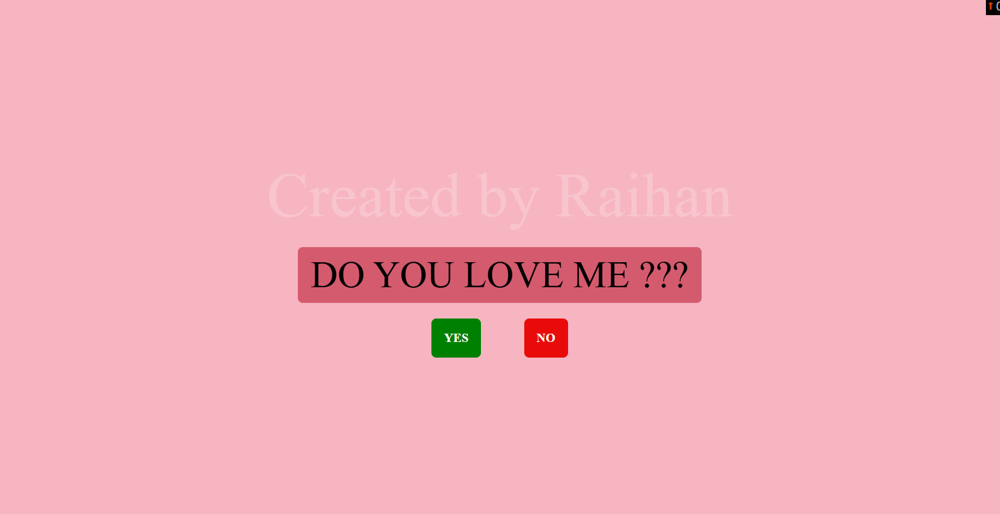
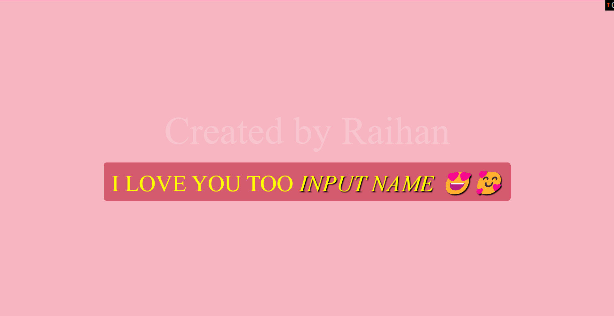
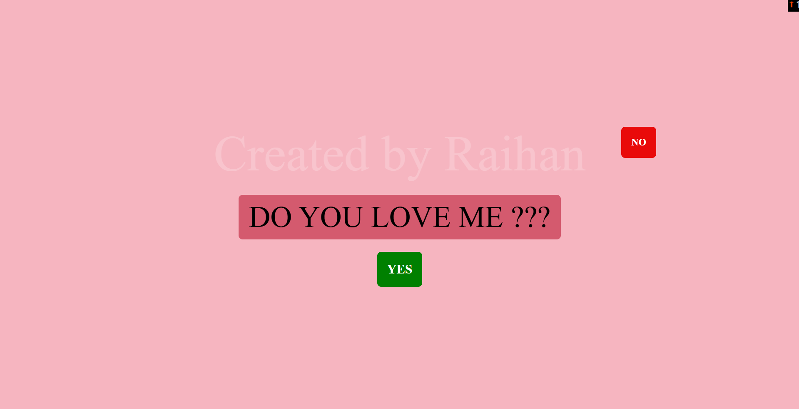

# site link :
# https://luv-mdraihanahmad.netlify.app/
     
# love-response-game 

❤️ Luv Fun - A Fun Yes/No Game 🎮 

Luv Fun is a simple and interactive web game where the player is asked a fun question: "Do you love me?". The game reacts dynamically based on the player's choice, making it a lighthearted and engaging experience. 💖 

🌟 Features 

✅ Fun and Interactive UI ✨ 
✅ Playful animations with a shaking "No" button 🎭 
✅ Dynamic response with name personalization 🎉 
✅ Fully responsive design for different screen sizes 📱💻 
✅ Pure HTML, CSS, and JavaScript (No frameworks required) 🚀 
 
🎮 How to Play 
 
1️⃣ Open the game in a browser. 
2️⃣ Enter your name when prompted. 
3️⃣ Click YES to express love 💖. 
4️⃣ Try clicking NO... if you can! (It moves away 🤣) 
 
🛠️ Technologies Used 
 
HTML - Structure of the game. 
 
CSS - Styling and animations. 
 
JavaScript - Game logic and interactions. 
 
📸 Screenshots 
🏠 Home Screen 

 
🎮 Gameplay 

 
💀 Game Over 

